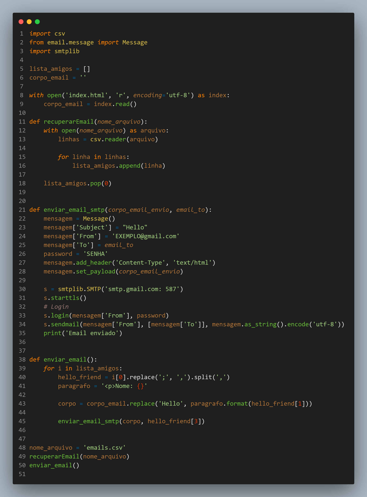

<h1>Send-emails.py</h1>

Um protótipo de programa em python que envia e-mails listados em um arquivo .csv

<h1>Bibliotecas</h1>

<h2>Email.message</h2>

O analisador sintático pega a versão serializada de uma mensagem de e-mail (um fluxo de bytes) e a converte em uma árvore de objetos EmailMessage. O gerador pega um EmailMessage e o transforma novamente em um fluxo de bytes serializado. (O analisador sintático e o gerador também lidam com fluxos de caracteres de texto, mas esse uso é desencorajado, pois é muito fácil terminar com mensagens que não são válidas de uma maneira ou de outra.)

<code>import email.message</code>

<h2>CSV</h2>

O módulo csv implementa classes para ler e gravar dados tabulares no formato CSV. Ele permite que os programadores digam “escreva esses dados no formato preferido pelo Excel” ou “leia os dados desse arquivo gerado pelo Excel”, sem conhecer os detalhes precisos do formato CSV usado pelo Excel. Os programadores também podem descrever os formatos CSV entendidos por outros aplicativos ou definir seus próprios formatos CSV para fins especiais.

<code>import csv</code>

<h2>Smtplib</h2>

Módulo usado para envios de e-mails

<code>import smtplib
</code>

<h2>Print do código</h2>

